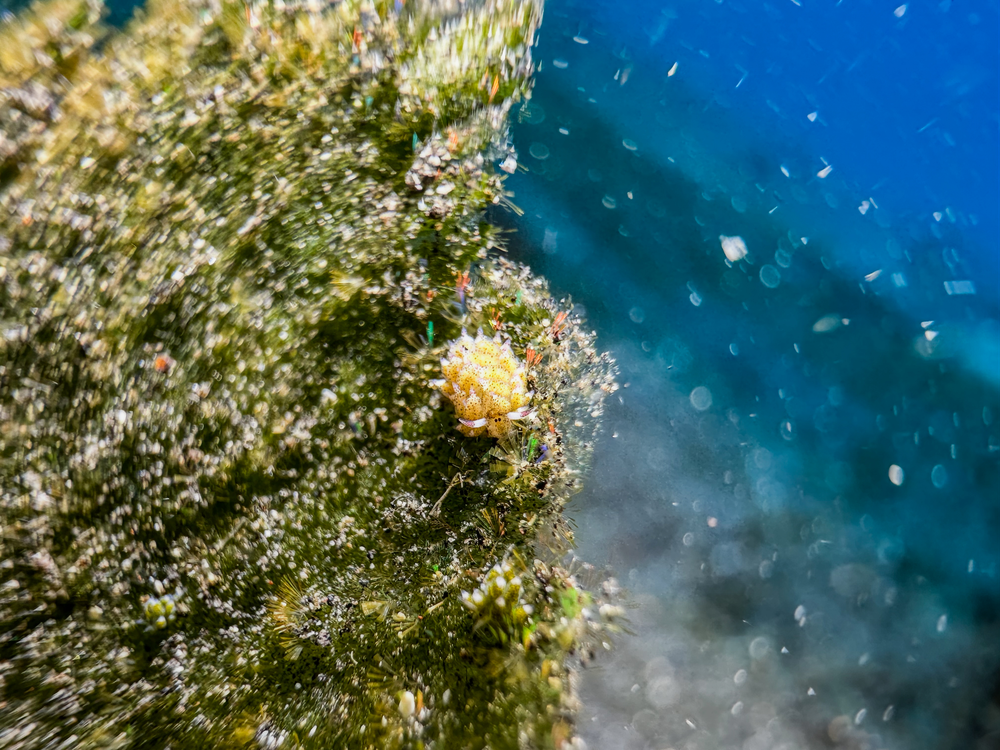

# The Setup
The setup I've used consists of:
* IPhone 14 Pro
* DIVEVOLK SeaTouch 4 casing
* SeaLife Sea Dragon 2500 lumen video light

This was the second setup I used after I switched from a SeaLife SportDiver case to DIVEVOLK's touch enabled casings.
The appeal of the system is that there are no electronics or third party apps that may fail during a dive trip.
A also found the third party camera app developed by SeaLife to be a little behind the native camera app of the phone.
For instance switching between lenses caused the app to freeze momentarily and features like slow-motion recording were not possible at the time.

What i like:
* Multiple lenses gives great flexibility for wide angle and macro
* Eliminates the step of transferring images from the camera to your device, typically the phone
* Very compact.
* No reliance on software -> touch simply works.
* Easy upgrade path.
* 60 meters
* clever way of sealing.

What I don't like
* Membrane leaks
* Filter thread only built into platinum version

# Samples

I've included some of my favorite shots taken with my IPhone 14 Pro inside of the casing.
All the photos are edited in Lightroom to give a fair idea of what the photos coming of the phone could look like.

## Macro

Traditionally, underwater photographers needed to make the choice between using a wide angle or a macro lens before a dive.
Interestingly, many modern phones sport a lens capable of taking macro shots.

One thing that I really appreaciate about using a phone casing is its small size that alows you to get close to many types of subjects -- even ones that are hiding inside the reef.
With my full-frame rig I often struggle getting the camera close enough to the subject due to tray and the strobe arms.

## Underwater panoramas

# Future

Synch with strobes