# The setup ⚙️

My setup consists of:
- Sony A7IV
- Sony 24-70mm f2.8 GM II
- SeaFrogs Salted Line housing
- SeaFrogs Long Flatport 
- 2 x BackScatter Hybrid Flash
- SeaFrogs flash trigger (old version)

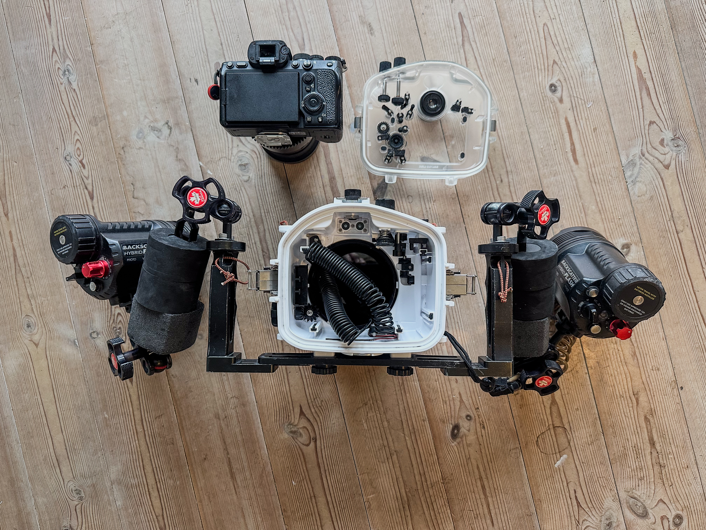

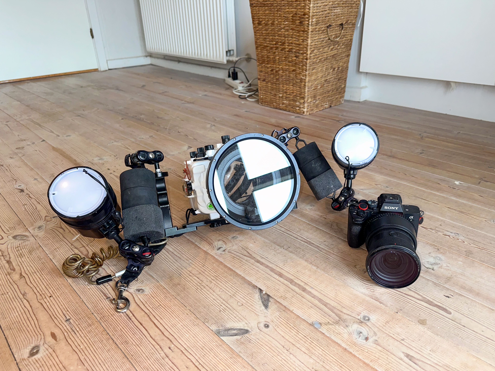

Why this choice of camera body and lens? The main reason is that I already owned the camera body and lens.
Given that I lived the last 1.5 years of my life out of two backpacks, buying a new camera system just for UW photography seemed like a waste.

There are a lot of sound arguments to choose something with a smaller sensor than a full frame camera.
Underwater everything adds up: A bigger sensor results in a bigger lens for a given focal length which in turn requires a larger port to house it, making the resulting rig much larger than something built for a APS-C camera.

Compared to other premium underwater housing brands, the housing from SeaFrogs is a lot cheaper, especially when the price of ports and accessories are factored in.
For reference I bought the housing, port and flash trigger directly from SeaFrogs for 768 USD.

# Impressions 💭

I've owned the housing for over a year and used it on around 50 dives.
Overall I am happy with the housing and I have never experienced any leaks.
One of the main critiques of the SeaFrogs housings is that they are made out of plastic and not an aluminum alloy.
Personally I don't think the material itself is an issue as long as you don't drop it on a hard floor. 
Plastic is lighter which means that you save on flights and you don't need to attach as many floats to the tray arms.

The past models are rumored to have had issues of flooding due to their clamshell design which relied on a single plastic latch to seal tightly. 
The more recent design has since been modified to use two metal latches instead.

That being said there is definitely room for improvement in the design of the product.

On my housing the plungers that push the buttons on the camera body were poorly aligned which meant that button presses would not register or would register as a neighbouring button being pressed.
To solve this I've resorted to gluing rubber pads to the inside of the housing to make the button mechanisms more reliable.

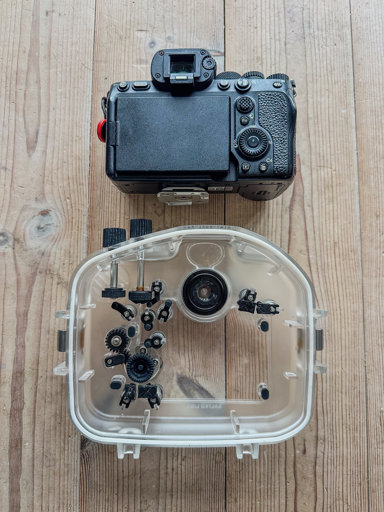

Another issue I encountered was that the arm on the housing responsible for turning the camera on and off can shift on the rod it is attached to.
This was easily resolved, but I contacted SeaFrogs which told me there was an easy fix which was forcefully turning it back.

Finally, the zoom gear has a tendency to slip off the collar of the lens, leaving you stuck with a single focal length for the rest of your dive. This can be partially mitigated by, you guessed it, gluing stuff to the zoom gear.
As far as I can tell this is a problem with the zoom gears for particular lenses, since other rings have the ability to lock them in place with a plastic bit screwed to the inside of the housing.

Again this is not the end of the world but it is certainly something that the designers at SeaFrogs could have addressed.

## SeaFrogs Flash Trigger

The SeaFrogs flash trigger is cheap and in this case you get what you pay for.
It usually lasts you exactly one dive -- if you are lucky.
It also has a tendency to drain itself completely if you forget to turn it off.
Beyond that there is not much to say, it reliably triggers the strobes and it is small and compact.

SeaFrogs have released a new version of the trigger with a larger battery and with a USB type-C port instead of a micro USB.
I haven't had the chance to try it out myself but it seems like the new design addresses a lot of the issues of the old product.

# Samples 📷

I've included some of my favorite photos taken with this setup from my most recent stay at Gili Trawangan, Komodo as well as my live aboard trip sailing from the Bahamas to Panama.

The first shots are of a reef manta ray. The manta highlights one of the challenges of a 24mm behind a flatport, which is the limited field of view.
Mantas being the chill creatures that they are, there were plenty of situations where I could not frame the whole body in the photo.

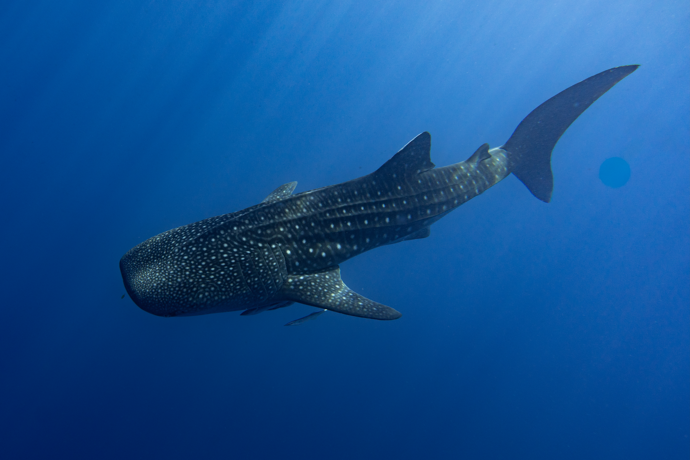

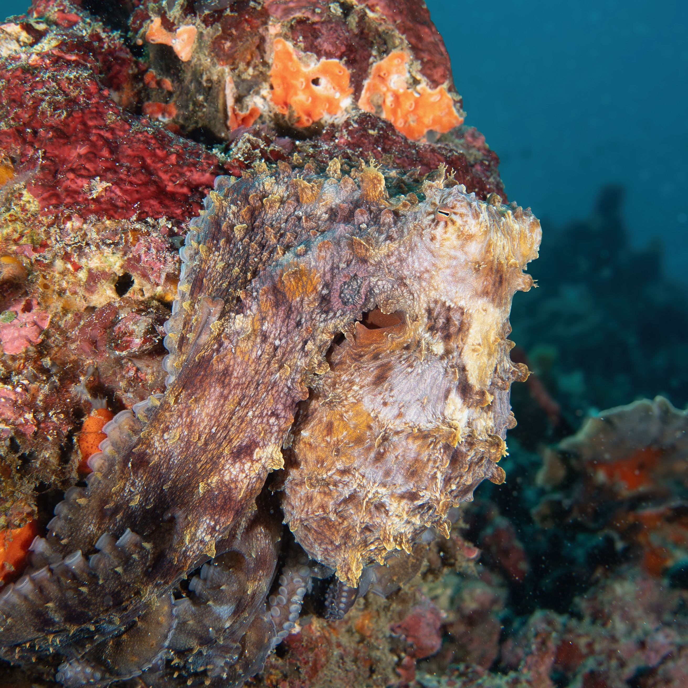

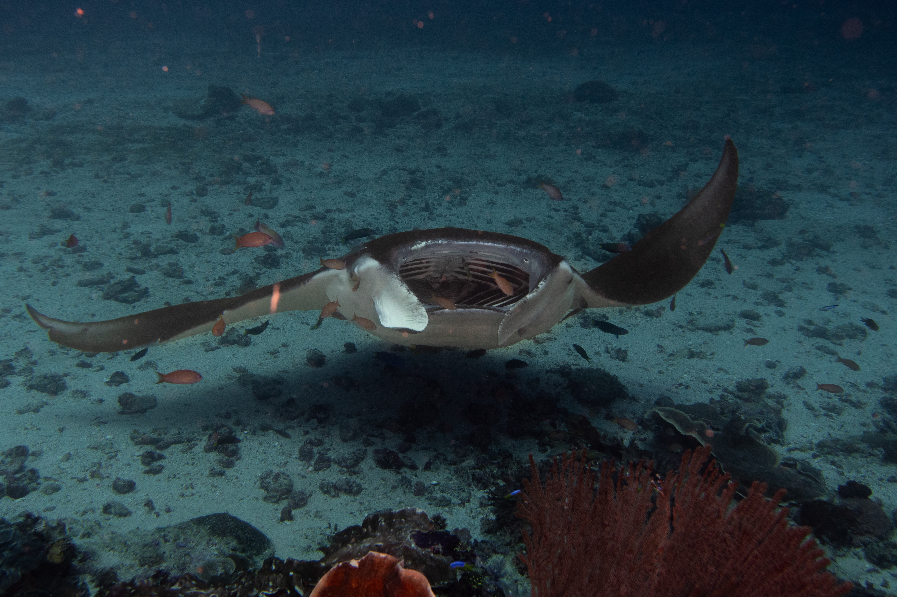

For slightly smaller and more skittish subjects the added reach of the 24-70mm gives a lot of flexibility for framing shots and even getting closeups.

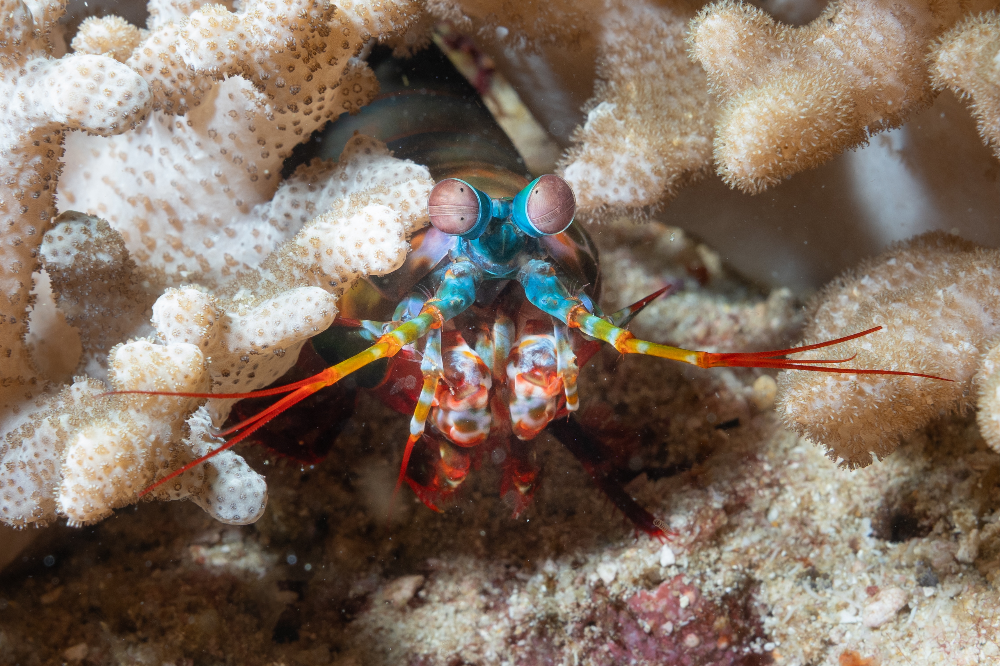

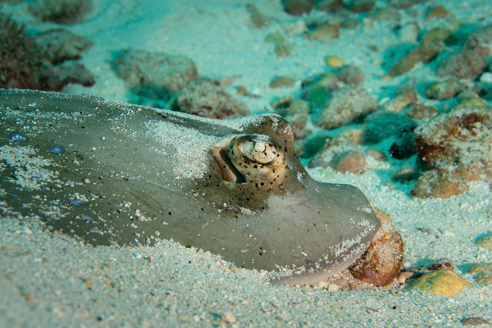

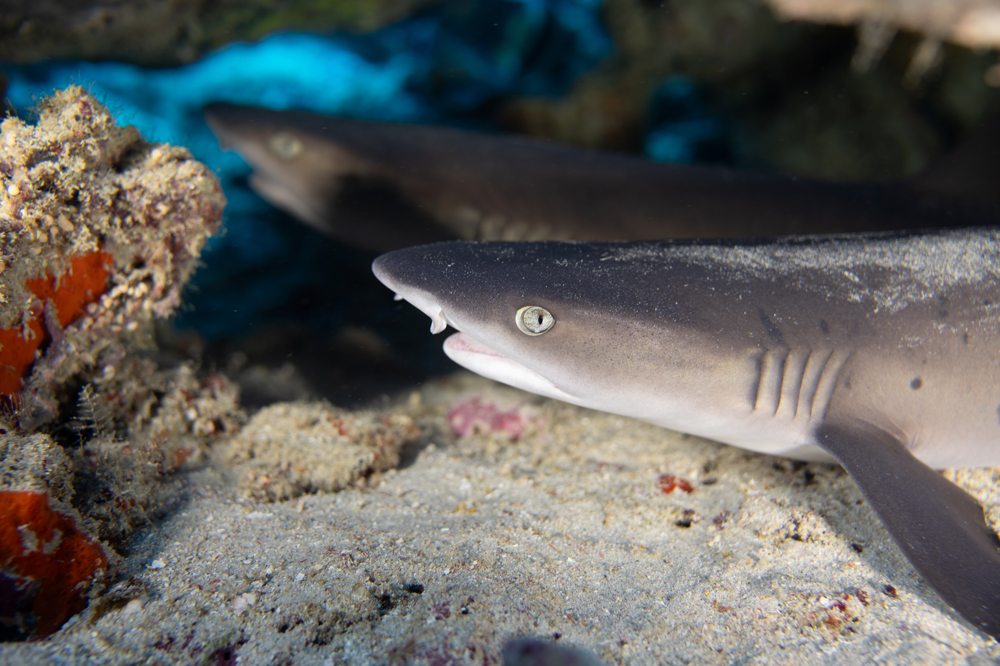

## Macro 🔬

The maximum magnification of the Sony 24-70mm f2.8 GM II is 0.32x.
In plain terms this means that the projection of a subject that is 1mm long would take up 0.32mm of the sensor.
In comparison a true macro lens provides a 1:1 ratio, meaning that the subject and the image projected onto the sensor have the same size.
If you wanted to use the whole area of the sensor to capture the subject it would have to be 1/0.32 times larger than the sensor.
This works out to a subject of the size 75mm x 112.5mm -- making this lens suitable for a lot of the small stuff you encounter while diving.

In the case of the clown frogfish or the giant frogfish we see that we can capture images with a high level of sharpness.

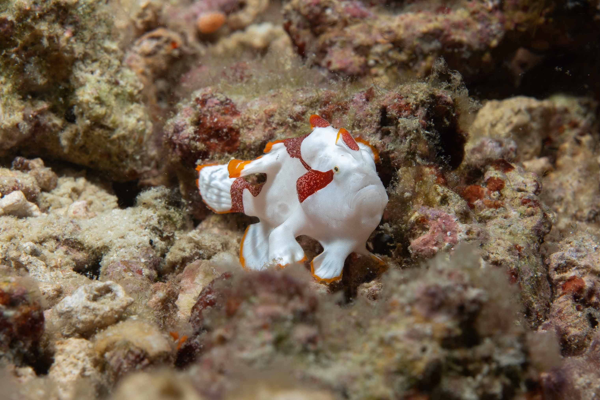

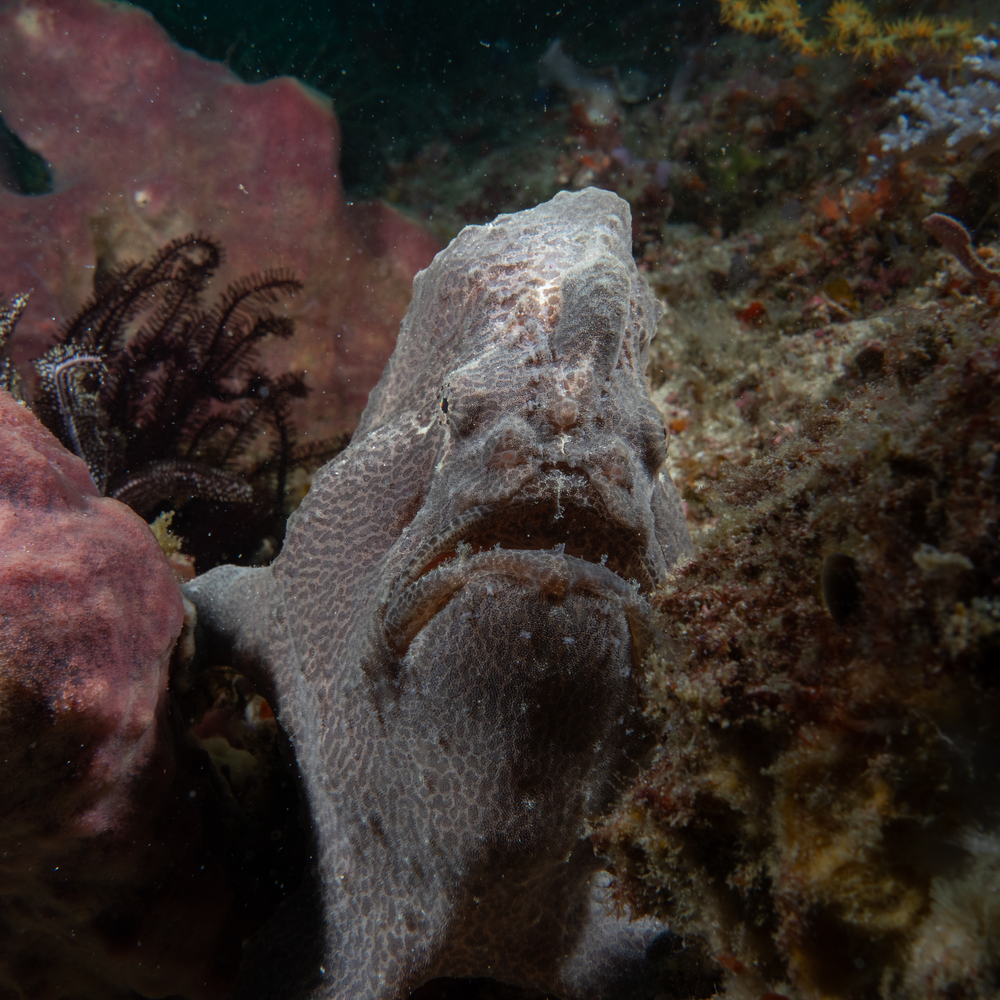

I suspect that the added magnification due to diffraction and using a flat port makes the maximum magnification larger. This is purely based on speculation and I would love to hear from someone that knows more about optics on the matter.

Searching for even smaller subjects we are now in the territory of the tiniest of fish and crustaceans

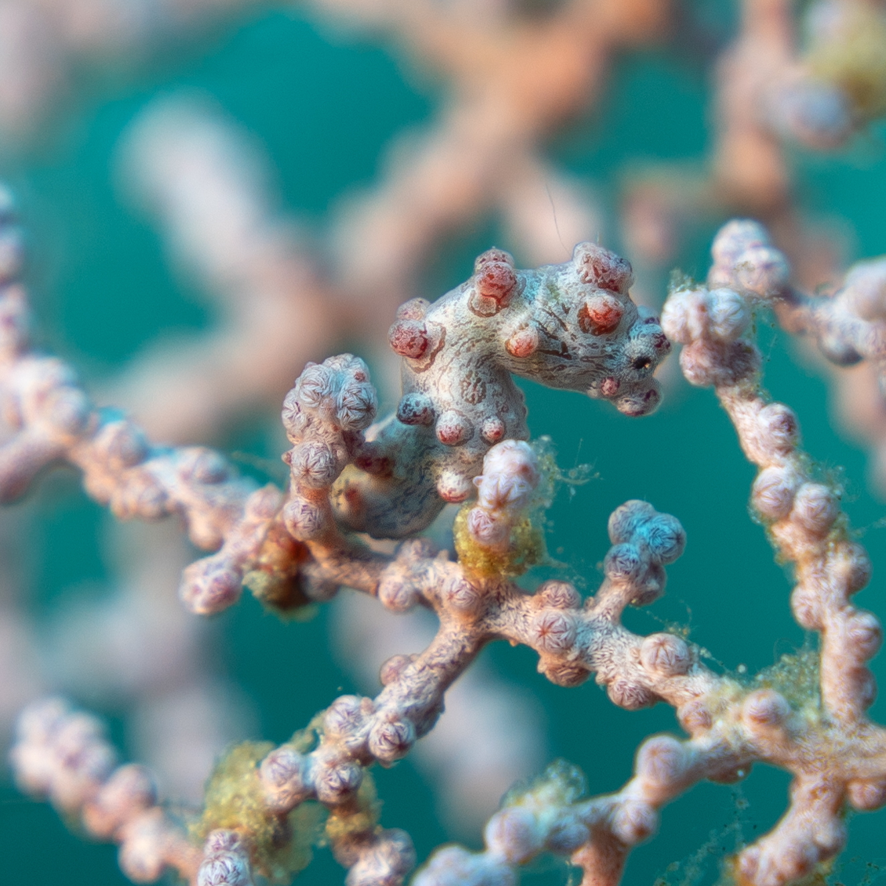

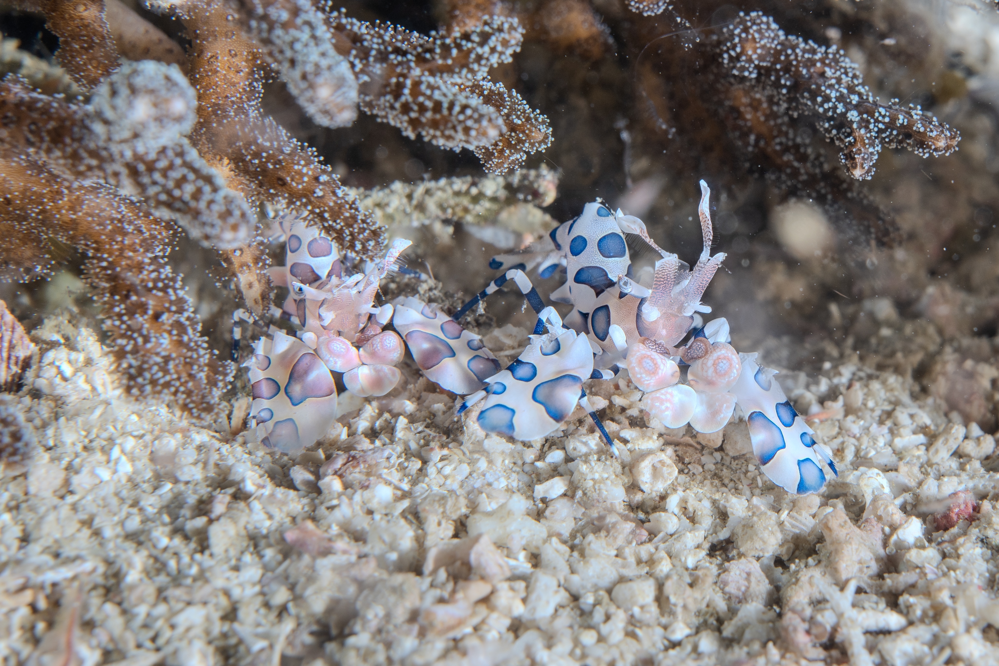

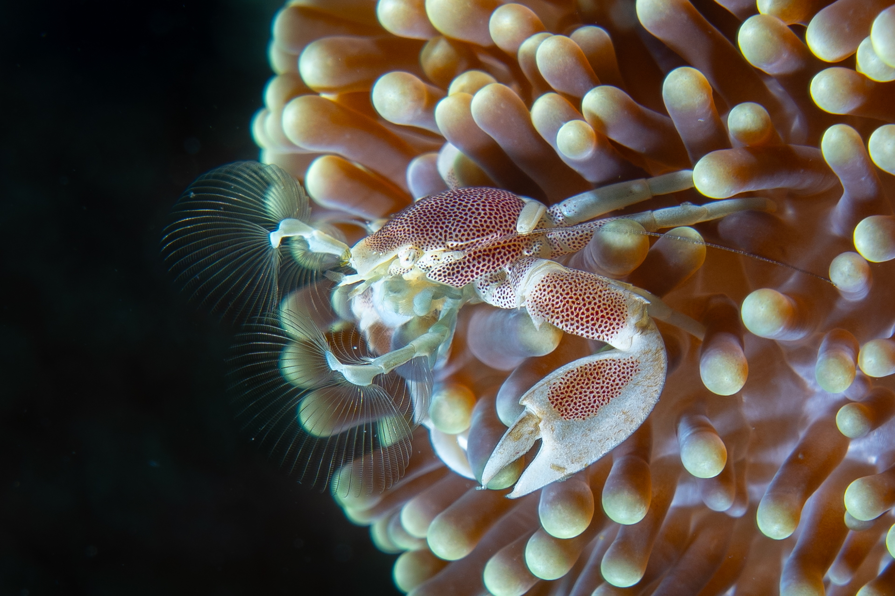

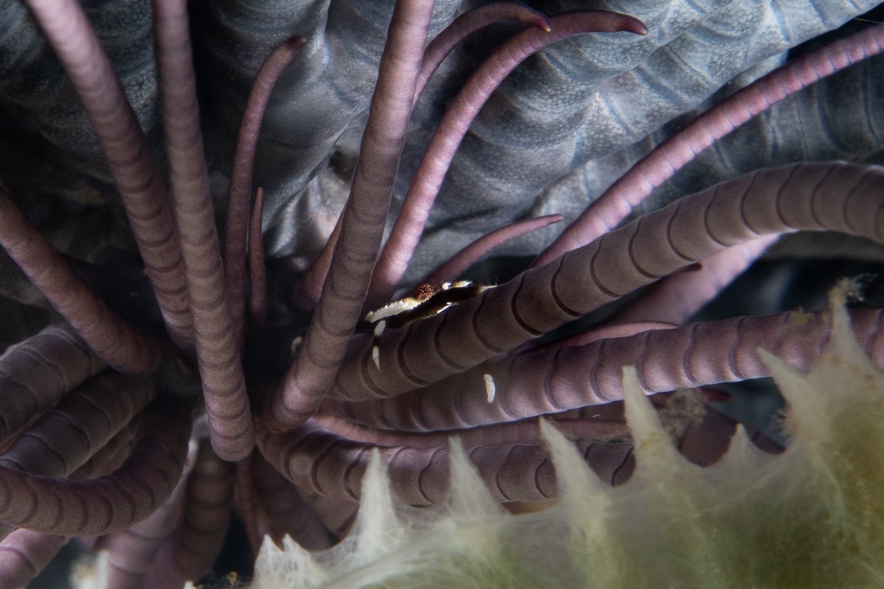

# Conclusion 📃

The SeaFrogs housing provides great value for aspiring underwater photographers.
Where it falls short is not its choice of materials but rather in ergonomical and reliability issues that could be fixed by better engineering and quality control.
I hope that SeaFrogs will continue to improve their low cost underwater housings to allow more people to get into underwater photography and to share their passion for diving.

Feel free to reach out if you have questions about any of the photographs or if you'd like to know more about specific locations.

Happy shooting!