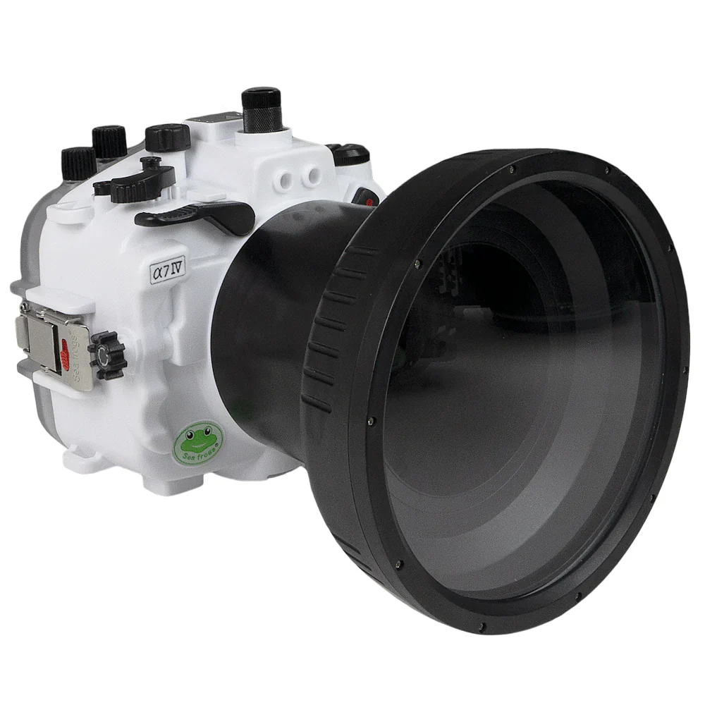
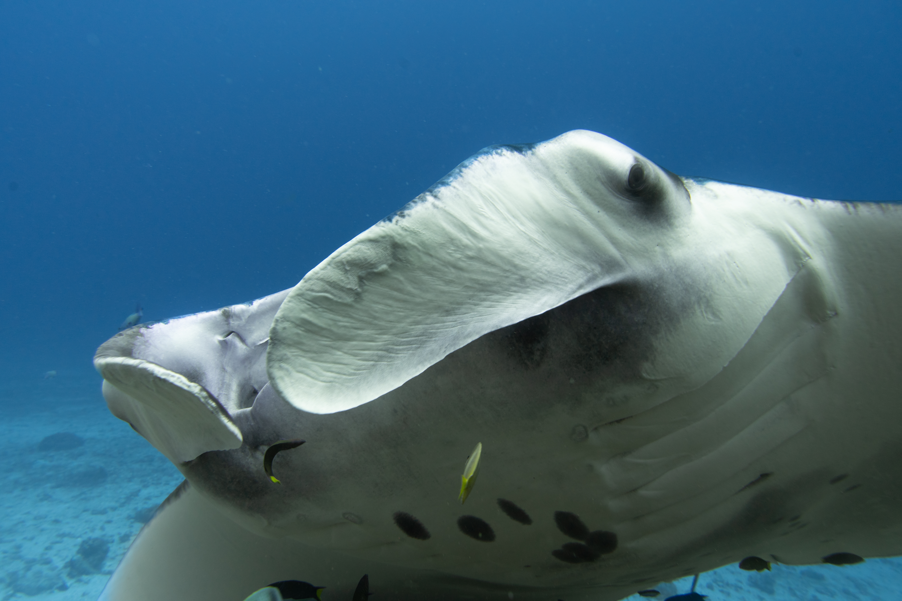
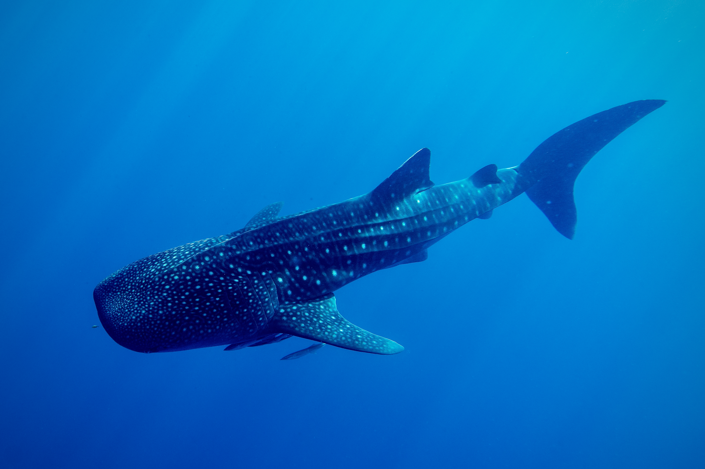

# The Equipment

My setup consists of:
- Sony A7IV
- Sony 24-70mm f2.8 GM II
- SeaFrogs Salted Line housing
- SeaFrogs Long Flatport 
- 2 x BackScatter Hybrid Flash
- SeaFrogs flash trigger (old version)

Why this setup? The main reason is that I already owned the camera body and lens.
Given that I lived the last 1.5 years of my life out of two backpacks buying a seperate system for UW photography seemed like a waste.

There are a lot of sound arguments to choose something with a smaller than a full frame camera.
Underwater everything adds up. A bigger sensor results in a bigger lens for a given focal length which in turn requires a larger port, adding to an already large setup.

# Sample Photos 

I've included some of my favorite photos taken with this setup form my most recent stay at Gili Trawangan, Komodo as well as my live aboard trip sailing from the Bahamas to Panama.

The first shots are of a reef manta ray. The manta highlights one of the challenges of a 24mm behind a flatport, which is the limited field of view.
Mantas being the chill creatures that they are there were plenty of situations where I could not frame whole body in the photo.

For slightly smaller and more skittish subjects the added reach of the 24-70mm gives a lot of flexibility for framing shots and even getting closeups.

## Macro 

The maximum magnification of the Sony 24-70mm f2.8 GM II is 0.32x.
In plain terms this means that the project of a subject that is 1mm long would take up 0.32mm of the sensor.
In comparison a true macro lens provides a 1:1 ratio, meaning that the subject and the image projected onto the sensor have the same size.
If you wanted to use the whole area of the sensor to capture the subject it would have to be 1/0.32 times larger than the sensor.
This works out to a subject of the size 75mm x 112.5mm -- making this lens suitable for a lot of the small stuff you encounter while diving.

In the case of the clown frogfish or the giant frogfish we see that we can capture images with a high level of sharpness.

I suspect that the added maginification due to diffraction and using a flat port makes the maximum magnification larger. This is purely based on speculation and I would love to hear from someone that knows more about optics on the matter.

Searching for even smaller subjects we are now in the territory of the tiniest of fish and crustaceans

# Post processing

It is important to recognize that the vast majority of images taken under water will come out looking dull and blue.
One of the benefits of using a camera with a high dynamic range and the ability to shoot in raw is that we can recover a lot of the color in post.

An example of what a image might look like after post processing compared to before can be seen for example of a whale shark below:

The night and day difference hopefully illustrates the importance of post processing to get images with nice colors.
I will eventually get around to posting a more detailed guide on how I process my images in Adobe Lightroom.

# Housing Quality

One of the main critiques of the SeaFrogs housings is that they are made out of plastic and not an aluminum alloy like a more premium housing.

Personally I don't think the material an issue. Plastic is lighter which means that I save on flights and I don't need to attach as many floats to my handles.
Clearly there is a risk to crack it if you drop you housing on a hard floor, but so would a lot of other things like phones or laptops.

The design of the old SeaFrogs housings relied on a single plastic latch.

## Let's Connect

I'm excited to share this journey with you. Feel free to reach out if you have questions about any of the photographs or if you'd like to know more about specific locations.

Happy exploring!